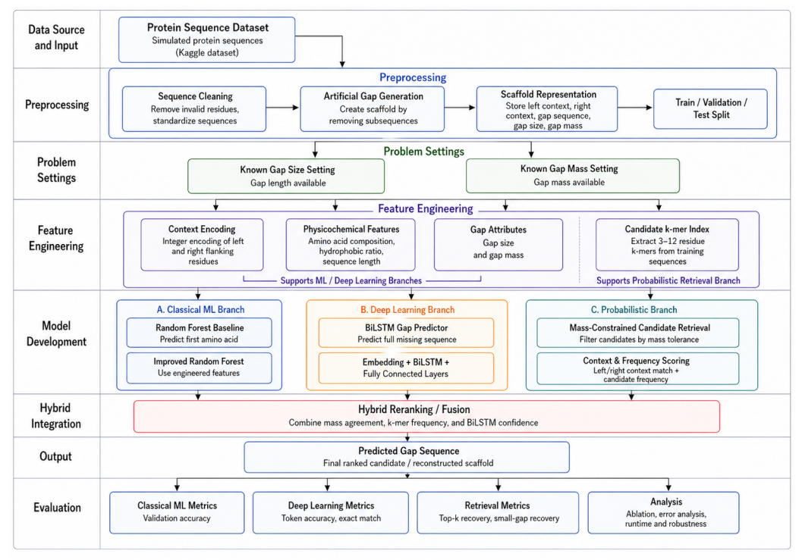

# Protein Scaffold Gap Filling

This repository contains an experimental attempt at protein scaffold gap filling using machine learning, BiLSTM models, and mass-constrained candidate selection. The project did not achieve complete scaffold reconstruction, but documents the approaches, experiments, results, and limitations.

A bioinformatics project exploring computational filling of missing amino-acid regions in protein scaffold sequences. The project investigates both known-gap-size and known-gap-mass settings using traditional machine learning, a BiLSTM sequence model, and mass-constrained candidate retrieval.

## Overview

Protein scaffold sequences can contain gaps where one or more amino acids are unknown. The goal of this project is to recover these missing residues using the sequence context around each gap and, when available, the expected mass of the missing region.

The current implementation combines several approaches:

- Masked 11-mer features with traditional machine learning models
- A weighted machine learning ensemble
- A BiLSTM model for full gap sequence prediction
- Mass-constrained candidate generation from homologous sequences
- Hybrid candidate reranking using model scores and mass information

The main implementation is **`notebooks/bio-project-final.ipynb`**.

## Project Data

The notebooks work with protein sequence data containing antibody-related training and target sequences. The final notebook reports the following sequence collections:

| Collection | Sequences | Length information |
|---|---:|---|
| MAB_TARGET | 1 | 214 residues |
| MAB_TRAINING | 1,000 | 206 to 449 residues |
| P5A_TRAINING | 1,000 | 193 to 764 residues |
| NEW_TARGETS | 11 | 213 to 216 residues |
| SCAFFOLD | 1 | 214 residues |
| P15 | 1,000 | 206 to 449 residues |
| P18 | 1,000 | 208 to 737 residues |

The final notebook creates a training set of **3,826,728 samples** for the gap-filling workflow.

The source datasets are not included in this repository. The notebooks contain the paths and loading logic used in the original environment, so those paths may need to be updated before running the notebooks elsewhere.

## Methodology


Workflow diagram of the proposed Architecture

### 1. Scaffold gap extraction

The scaffold contains six gaps. The final notebook extracts their positions, sizes, surrounding sequence context, and original sequences for evaluation.

The gap sizes are:

```text
3, 3, 3, 4, 11, 4
```

### 2. Known-gap-size prediction

For the known-size setting, masked 11-mer samples are generated from the available protein sequences. Amino acids are encoded numerically and used as input to multiple machine learning models.

The final notebook also uses a weighted ensemble based on validation performance.

### 3. BiLSTM sequence model

The final notebook includes a BiLSTM branch for predicting complete gap sequences from left and right sequence context.

The recorded model uses:

- Embedding size: 192
- LSTM hidden size: 384
- 2 LSTM layers
- Bidirectional LSTM
- Dropout: 0.3
- Maximum context length: 30
- Maximum gap length: 12

The model reached a validation token accuracy of **0.9066** at epoch 20 in the recorded run.

### 4. Known-gap-mass prediction

For gaps where the missing region's mass is known but its exact sequence or length is unknown, the project generates candidate sequences from homologous sequences and filters/ranks them using amino-acid mass constraints.

The hybrid reranking stage combines information such as candidate mass consistency, machine learning scores, and deep-learning confidence.

## Results

### Final scaffold reconstruction

The final notebook evaluates six gaps in the scaffold:

| Gap | Size | True sequence | Prediction | Exact match |
|---|---:|---|---|---|
| 1 | 3 | `DIQ` | `SQS` | No |
| 2 | 3 | `ASQ` | `SQD` | No |
| 3 | 3 | `SGS` | `SGS` | Yes |
| 4 | 4 | `SGTD` | `SGTD` | Yes |
| 5 | 11 | `SSLQPEDIATY` | `SSLQPEDIATY` | Yes |
| 6 | 4 | `RGEC` | `RGEC` | Yes |

The recorded final scaffold evaluation reports:

- **Residue accuracy: 0.8785**
- **Exact reconstruction: False**
- **4 of 6 gaps recovered exactly**

The residue accuracy is calculated over the reconstructed scaffold rather than being a standalone validation accuracy for the BiLSTM model.

## Project Structure

```text
.
├── README.md
├── requirements.txt
├── .gitignore
├── figures/
│   └── workflow-diagram.png
├── notebooks/
│   ├── bio-project-final.ipynb
│   ├── bioinformatics-project.ipynb
│   └── protein.ipynb
└── docs/
    └── project-paper.pdf
```

## Notebooks

### `bio-project-final.ipynb`

The current/final notebook. It contains the consolidated workflow for:

- Dataset inspection
- Scaffold gap extraction
- Training-data generation
- Machine learning experiments
- Weighted ensemble prediction
- BiLSTM training
- Known-size gap filling
- Known-mass candidate generation
- Hybrid reranking
- Scaffold reconstruction
- Gap-level error analysis

### `bioinformatics-project.ipynb`

An earlier project notebook containing an earlier implementation and experimentation workflow.

### `protein.ipynb`

A broader experimental notebook containing additional machine learning models, feature variants, ensemble experiments, known-size gap filling, known-mass processing, and related analysis.

## Technologies

- Python
- NumPy
- pandas
- scikit-learn
- PyTorch
- Biopython
- Matplotlib
- tqdm

Additional experimental notebooks also use TensorFlow, XGBoost, LightGBM, and CatBoost.

## Limitations

- The final evaluation uses a single scaffold with six known gaps.
- The recorded scaffold reconstruction is not an exact reconstruction.
- The training data are sequence-based and do not represent a broad experimental mass-spectrometry benchmark.
- Reproducing the notebooks requires access to the source sequence datasets and may require updating environment-specific paths.
- The mass-constrained branch depends on homologous sequence retrieval, so its usefulness can depend on the available homologs.

## Project Paper

A project paper is included in `docs/project-paper.pdf`:

**A Possible Hybrid Machine Learning, BiLSTM, and Mass-Constrained Probabilistic Framework for Known-Size and Known-Mass Protein Scaffold Gap Filling**

The paper should be treated as supporting project documentation. The final notebook is the primary reference for the current implementation and recorded results.
